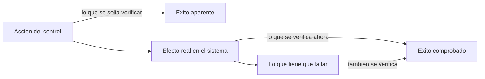
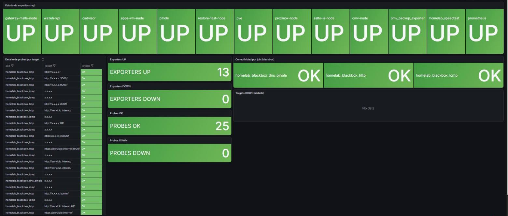
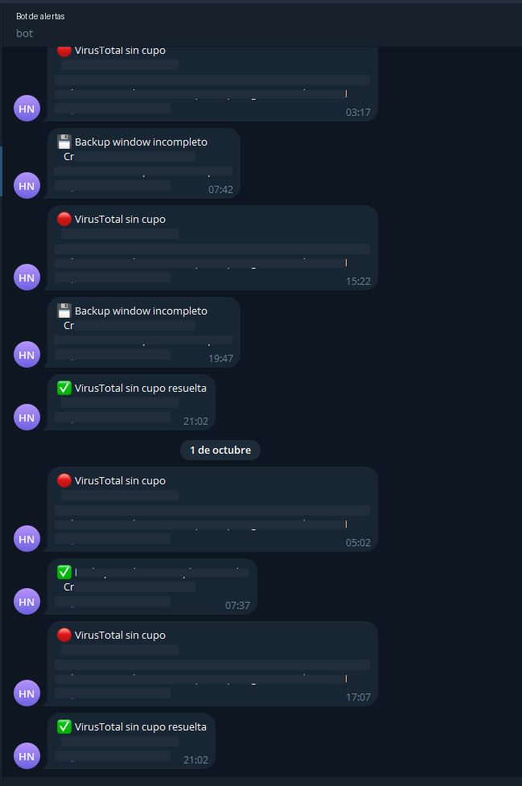

# Alerts That Matter

> Alertas que solo suenan por fallos reales, y controles que se verifican por su efecto.

Este repositorio documenta, de forma sanitizada, el stack de observabilidad y
visibilidad de seguridad de una infraestructura productiva personal (homelab): metricas, dashboards,
alertas y SIEM. Incluye un caso real extenso sobre un problema recurrente:
controles automatizados que informaban un resultado que no correspondia con
la realidad.

Es parte de un portfolio tecnico. **No es un laboratorio de prueba: es
infraestructura productiva.** No tiene la escala de una empresa, pero tiene
todas sus piezas -virtualizacion, red segmentada, DNS, almacenamiento, backups
con copia externa, monitoreo, SIEM, acceso remoto y aplicaciones en uso- y
funciona 24/7 sobre un hipervisor de tipo 1 (Proxmox VE) en un servidor dedicado. Cuando
algo falla, el impacto es real.

La documentacion operativa es privada. Esto es su version transformada
-decisiones, patrones y aprendizajes-, sin datos que permitan identificar o
reproducir el entorno.

Lo que busca demostrar: diseno de alertas que solo avisan de fallos reales
(sin ruido que ensene a ignorar el canal), separacion entre metricas de
infraestructura y evidencia de seguridad, y la disciplina de verificar el
efecto de un control en vez de la accion que deberia haberlo producido -una
leccion que aparecio siete veces distintas en una sola semana de trabajo.

## Escala chica, exigencia de produccion

| Pieza | Con que | Si falla |
|---|---|---|
| Virtualizacion | Proxmox VE, hipervisor de tipo 1; una maquina por funcion | cae todo lo demas |
| DNS interno | Pi-hole, resolucion para todos los equipos y servicios | todo parece caido aunque este sano |
| Red y acceso remoto | zonas por funcion; Tailscale sin puertos abiertos, politica por puerto | se pierde el aislamiento o el acceso desde afuera |
| Almacenamiento y backups | OpenMediaVault, backups nocturnos, copia cifrada externa, pruebas de restauracion | se pierde la capacidad de recuperar |
| Monitoreo y seguridad | Prometheus, Grafana, Wazuh y alertas al telefono | los incidentes pasan sin que nadie se entere |
| Aplicaciones propias | Docker detras de Nginx Proxy Manager; una envia correo real | se frena trabajo real |
| Codigo | Forgejo privado con integracion continua | no hay donde versionar ni desde donde desplegar |

Lo mismo que en una empresa, en chico: cambios con plan y rollback, evidencia,
alertas que avisan solas y controles que se prueban haciendolos fallar.

## En 30 segundos

| Indicador | Resultado |
|---|---|
| Verificaciones que informaban algo falso, en una sola semana | **7** |
| Rechazos de politica invisibles hasta construir la deteccion | **13.017** en 34 horas |
| Registro vs metrica ante 22 intentos | **6** lineas contra **23** paquetes contados |
| Formas validas de una alerta | **3**: algo fallo, algo no se hizo, algo dejo de pasar |
| Mensajes de "todo OK" en el canal de alertas | **0**, por regla |

## En vivo

_Capturas reales del entorno, con nombres, direcciones, usuarios y versiones reemplazados por su funcion._

Salud: 13 exporters y 25 sondas; cualquier rojo dispara una alerta al telefono.

SIEM (Wazuh): 8 agentes activos, 0 desconectados, 0 alertas criticas en 24 horas.

Wazuh en 24 horas: cero alertas criticas o altas; el volumen bajo es ruido conocido y clasificado.

Alertas al telefono: solo cuando algo falla y cuando se resuelve. Sin "todo OK".

## Problema, decision, resultado

| Problema | Por que importaba | Que se hizo | Resultado |
|---|---|---|---|
| Siete verificaciones informaban algo falso en una sola semana | un control que miente da confianza sin proteger | verificar el efecto, y lo que tiene que fallar | practica aplicada a todo script de seguridad |
| 13.017 rechazos de politica sin una sola alerta | la segmentacion funcionaba pero nadie lo veia | decodificador, reglas y umbral calibrado con el incidente real | alerta validada con trafico real |
| El primer canal de alertas no entregaba nada desde hacia meses | las reglas se evaluaban sin destino | canal de mensajeria con integracion nativa | ninguna alerta sin destino verificado |

El detalle de cada uno, con lo que salio mal en el camino, esta en los casos de estudio.

## Indice

- [Ficha rapida para quien evalua](contexto.md)
- [Observabilidad, alertas y SIEM](docs/01-observabilidad-alertas-siem.md)
- [Caso de estudio: cuando un control no mide lo que dice medir](docs/casos-de-estudio/01-cuando-un-control-no-mide-lo-que-dice-medir.md)
- [Caso de estudio: 13.017 rechazos que nadie vio](docs/casos-de-estudio/02-trece-mil-rechazos-invisibles.md)

## Parte de una serie

Este repo es una pieza de **[Homelab Prod](https://github.com/Nicolasperaltait/homelab)**:
la vista completa de una infraestructura productiva, chica en escala y completa
en piezas, encendida 24/7. Cada repo de la serie se lee solo; la portada los une.

- [Zero Trust Remote Access](https://github.com/Nicolasperaltait/zero-trust-remote-access)
- [Network Segmentation Playbook](https://github.com/Nicolasperaltait/network-segmentation-playbook)
- [Alerts That Matter](https://github.com/Nicolasperaltait/alerts-that-matter) (este repo)
- [Backups That Don't Lie](https://github.com/Nicolasperaltait/backups-that-dont-lie)
- [Hypervisor as Control Plane](https://github.com/Nicolasperaltait/hypervisor-as-control-plane)
- [SecOps Governance Blueprint](https://github.com/Nicolasperaltait/secops-governance-blueprint)

## Licencia

Ver [LICENSE.md](LICENSE.md).
