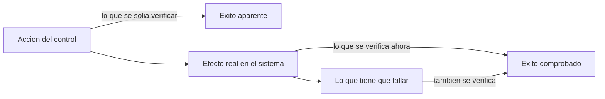

# Alerts That Matter

> Alertas que solo suenan por fallos reales, y controles que se verifican por su efecto.

Este repositorio documenta, de forma sanitizada, el stack de observabilidad y
visibilidad de seguridad de un homelab personal (metricas, dashboards,
alertas y SIEM), y un caso real extenso sobre un problema recurrente:
controles automatizados que informaban un resultado que no correspondia con
la realidad.

Es parte de un portfolio tecnico pensado para entrevistas de trabajo. No es
documentacion operativa de un entorno en produccion: es una version
transformada -decisiones, patrones y aprendizajes- de un homelab real, sin
datos que permitan identificarlo o reproducirlo.

Lo que busca demostrar: diseno de alertas que solo avisan de fallos reales
(sin ruido que ensene a ignorar el canal), separacion entre metricas de
infraestructura y evidencia de seguridad, y la disciplina de verificar el
efecto de un control en vez de la accion que deberia haberlo producido -una
leccion que aparecio siete veces distintas en una sola semana de trabajo.

## En 30 segundos

| Indicador | Resultado |
|---|---|
| Verificaciones que informaban algo falso, en una sola semana | **7** |
| Rechazos de politica invisibles hasta construir la deteccion | **13.017** en 34 horas |
| Registro vs metrica ante 22 intentos | **6** lineas contra **23** paquetes contados |
| Formas validas de una alerta | **3**: algo fallo, algo no se hizo, algo dejo de pasar |
| Mensajes de "todo OK" en el canal de alertas | **0**, por regla |

## Indice

- [Ficha rapida para quien evalua](contexto.md)
- [Observabilidad, alertas y SIEM](docs/01-observabilidad-alertas-siem.md)
- [Caso de estudio: cuando un control no mide lo que dice medir](docs/casos-de-estudio/01-cuando-un-control-no-mide-lo-que-dice-medir.md)
- [Caso de estudio: 13.017 rechazos que nadie vio](docs/casos-de-estudio/02-trece-mil-rechazos-invisibles.md)

## Parte de una serie

Este repo es una pieza de un proyecto mas grande: un **homelab personal**
operado como infraestructura real y documentado en cinco repos
independientes. Cada uno se lee solo; juntos muestran el entorno completo.

- [Zero Trust Remote Access](https://github.com/Nicolasperaltait/zero-trust-remote-access)
- [Backups That Don't Lie](https://github.com/Nicolasperaltait/backups-that-dont-lie)
- [Alerts That Matter](https://github.com/Nicolasperaltait/alerts-that-matter) (este repo)
- [Network Segmentation Playbook](https://github.com/Nicolasperaltait/network-segmentation-playbook)
- [Hypervisor as Control Plane](https://github.com/Nicolasperaltait/hypervisor-as-control-plane)

## Licencia

Ver [LICENSE.md](LICENSE.md).
