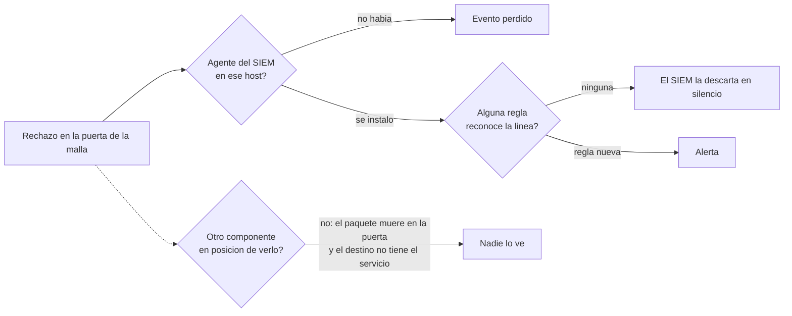

# Caso de Estudio - 13.017 Rechazos que Nadie Vio

## Contexto

La malla de acceso remoto deniega por defecto y registra cada paquete que su
politica rechaza. Se estaba construyendo la deteccion de esos rechazos en el
SIEM cuando, al buscar lineas reales para probarla, aparecio un incidente
que llevaba **34 horas** en curso.

## Lo que paso

| Dato | Valor |
|---|---|
| Rechazos de politica | **13.017** |
| Duracion | 34 horas |
| Ritmo | ~379 por hora |
| Origen | un asistente de IA de escritorio reintentando una conexion SSH sin fin |
| Destino | el DNS interno, que no tiene servicio SSH y cuyo permiso solo cubre DNS y web |
| Dano | **ninguno**: la politica freno todos |
| Alertas generadas | **cero** |

La segmentacion funciono. **La visibilidad no.** El detalle de red esta en
[Network Segmentation Playbook](https://github.com/Nicolasperaltait/network-segmentation-playbook/blob/main/docs/02-resultados-medidos.md).

## Por que nadie se entero: tres capas fallaron a la vez

| Capa | Que fallo |
|---|---|
| Recoleccion | el host donde ocurria el rechazo no tenia agente del SIEM |
| Interpretacion | una vez instalado, ninguna regla reconocia la linea, y el SIEM **descarta en silencio** lo que no coincide con ninguna regla |
| Redundancia | ningun otro componente podia verlo: el paquete moria en la puerta y el destino ni siquiera escuchaba |

**La pregunta "por que no me avise?" casi nunca tiene una sola respuesta.**

## La solucion

Un decodificador para la linea de rechazo y tres reglas:

| Regla | Severidad | Que hace |
|---|---|---|
| Base | 0 | reconoce el evento, no alerta |
| Rechazo individual | 3 | registra origen, destino y puerto |
| Rafaga | **10** | **15 o mas rechazos del mismo origen en 5 minutos** |

**El umbral salio de los datos, no de la intuicion:** el incidente real
producia unos 31 rechazos cada 5 minutos. Quince lo detecta con margen y no
salta por alguien que tipea mal una contrasena y reintenta cinco veces.

## Validacion con trafico real

No se valido con un evento sintetico: se genero trafico real desde un equipo
del operador, recorriendo la cadena completa
(rechazo, registro, agente, servidor, decodificador, regla, alerta).

| Prueba | Resultado |
|---|---|
| Campos extraidos | origen, destino, puertos, protocolo y motivo |
| Alertas de rechazo individual | **19** |
| Alertas de rafaga | **1**, severidad 10 |

## El hallazgo tecnico: el registro miente por omision

Se midio cuantos rechazos llegaban al registro frente a la metrica del mismo
componente.

| Fuente | 22 intentos en 14 segundos |
|---|---|
| Lineas en el registro | **6** |
| Contador de la metrica | **23**, exacto |

El componente **limita la tasa de su propio registro** y lo declara al
pasar. Consecuencia de diseno:

| Fuente | Sirve para | No sirve para |
|---|---|---|
| Registro | saber **quien y hacia donde** | contar |
| Metrica | saber **cuanto**, exacto | investigar |

**Hacen falta las dos.** Un ataque sostenido no se escapa: el limitador deja
pasar una linea cada ~2 segundos, de sobra para el umbral. **El hueco es la
rafaga corta**, que puede quedar debajo del umbral porque el registro colapsa
lineas. Se tapa con una alerta sobre el contador de la metrica, que cuenta
paquetes exactos. **Estado honesto: esa alerta queda pendiente.**

## Dos errores propios, atajados por el mismo control

| Error | Que habria pasado |
|---|---|
| Una opcion de validacion que no existe en la version instalada | la validacion no habria validado nada |
| Un nombre de campo reservado por el SIEM | el servidor rechaza el conjunto de reglas entero y **no arranca** |

Los dos los freno la misma practica: **validar el conjunto de reglas antes de
reiniciar, y borrar los archivos nuevos si la validacion falla.** Ninguno
llego al servidor.

## Lecciones

- **Un sistema de monitoreo solo ve lo que tiene agente Y regla.** Las dos cosas.
- Un SIEM que descarta en silencio lo que no reconoce necesita una prueba
  explicita de que **reconoce** lo que importa.
- El volumen se mide con contadores; los registros sirven para investigar.
- Un umbral de alerta se calibra contra un incidente real, no contra un numero redondo.
